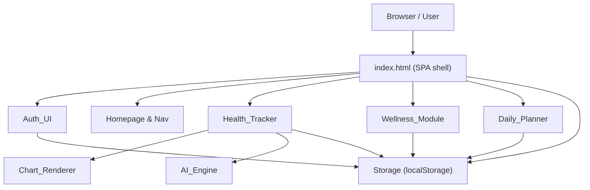
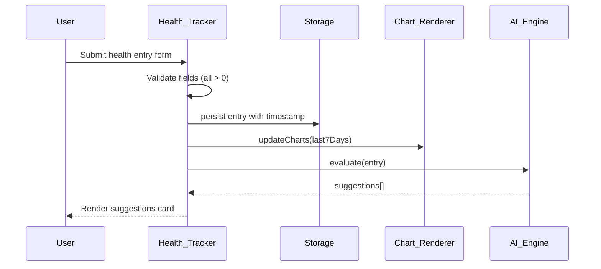

# Design Document

## Smart Health Companion

---

## Overview

Smart Health Companion is a single-page web application (SPA) that provides AI-powered health and wellness tracking entirely in the browser. All logic is client-side: no backend, no API calls. The application is built with HTML5, CSS3, vanilla JavaScript (ES6+), and Bootstrap 5.

The application is organized into seven cooperating modules:

- **Auth_UI** — login/signup forms backed by localStorage
- **Health_Tracker** — daily metric input and validation
- **Chart_Renderer** — Chart.js-based visualization of metric history
- **AI_Engine** — rule-based recommendation engine
- **Wellness_Module** — mood tracker, motivational quotes, and keyword-matched chatbot
- **Daily_Planner** — CRUD task list with completion tracking
- **Storage** — thin wrapper around `localStorage` with `shc_` namespace

The entire application lives in a single HTML file with modular JavaScript files loaded as ES modules (or concatenated for simplicity). Bootstrap 5 handles the responsive grid and component library.

---

## Architecture



### Module Interaction Flow



### Page Structure (Single HTML File)

The SPA uses CSS `display` toggling and anchor-based smooth scroll to simulate navigation between sections. No client-side router is required.

```
index.html
├── <head>  Bootstrap 5 CDN, Chart.js CDN, Bootstrap Icons CDN
├── Loading Spinner Overlay  (hidden after 800ms)
├── <nav>   Navbar (Home | Features | Tracker | Mental Wellness | Contact)
├── #auth   Auth_UI section (login / signup forms)
├── #home   Hero section + Features cards
├── #tracker  Health_Tracker + Chart_Renderer + AI recommendations
├── #wellness  Wellness_Module (mood + chatbot)
├── #planner   Daily_Planner
├── #contact   Contact / Footer
└── <script> modules
```

---

## Components and Interfaces

### Auth_UI

Responsibilities: render signup/login forms, validate inputs, read/write credentials in Storage, manage session state.

```js
// Public interface
AuthUI.showSignup()
AuthUI.showLogin()
AuthUI.handleSignup(formData)   // returns { ok, error }
AuthUI.handleLogin(formData)    // returns { ok, error }
AuthUI.isLoggedIn()             // returns boolean
AuthUI.logout()
```

Session state is stored as `shc_session` in localStorage (username string or null).

### Health_Tracker

Responsibilities: render metric input form, validate, delegate to Storage, Chart_Renderer, and AI_Engine.

```js
HealthTracker.submitEntry(entry)  // { steps, water, sleep, calories }
// returns { ok, errors[] }
HealthTracker.getHistory()        // returns Entry[]
```

### Chart_Renderer

Responsibilities: initialize Chart.js instances, update datasets on new entries.

```js
ChartRenderer.init(canvasIds)
ChartRenderer.update(history)   // re-renders all 4 charts with last-7-days data
```

Four charts: Steps (bar), Water (line), Sleep (line), Calories (bar).

### AI_Engine

Responsibilities: evaluate a health entry against thresholds, return an array of suggestion strings.

```js
AIEngine.evaluate(entry)        // returns string[]
AIEngine.getDailyExerciseTip(entry)  // returns string
AIEngine.getDailyDietTip(entry)      // returns string
```

Thresholds (constants):
| Metric | Threshold | Direction |
|--------|-----------|-----------|
| steps | 8000 | below → suggest more activity |
| water | 2.0 L | below → suggest more water |
| sleep | 7.0 h | below → suggest more sleep |
| calories | 2500 | above → suggest dietary review |

### Wellness_Module

Responsibilities: mood selection, quote display, chatbot conversation.

```js
WellnessModule.selectMood(mood)         // persists, returns quote string
WellnessModule.getDailyQuote()          // returns string from quote pool
WellnessModule.sendChatMessage(text)    // returns response string (≤500ms)
WellnessModule.getChatHistory()         // returns Message[]
```

Mood options: `Happy | Calm | Sad | Stressed | Anxious`

Chatbot uses a keyword → response map. If no keyword matches, returns a default supportive message.

### Daily_Planner

Responsibilities: task CRUD, completion toggling, progress calculation.

```js
DailyPlanner.addTask(text)          // returns { ok, error }
DailyPlanner.toggleTask(id)
DailyPlanner.deleteTask(id)
DailyPlanner.getTasks()             // returns Task[]
DailyPlanner.getProgress()          // returns { completed, total }
```

### Storage

Thin wrapper enforcing the `shc_` namespace prefix.

```js
Storage.set(key, value)     // JSON.stringify, prefixes key
Storage.get(key)            // JSON.parse, prefixes key
Storage.remove(key)
Storage.isAvailable()       // returns boolean (try/catch probe)
```

All modules call `Storage.isAvailable()` on init; if false, a warning banner is shown.

---

## Data Models

### User Credential

```js
// Storage key: shc_users  (array)
{
  username: string,
  email: string,
  passwordHash: string   // simple hash (e.g., btoa) — no real security needed (no backend)
}
```

### Session

```js
// Storage key: shc_session
{
  username: string
}
```

### Health Entry

```js
// Storage key: shc_health_entries  (array)
{
  id: string,           // crypto.randomUUID() or Date.now().toString()
  date: string,         // ISO 8601 date string
  steps: number,        // integer > 0
  water: number,        // decimal > 0, liters
  sleep: number,        // decimal > 0, hours
  calories: number      // integer > 0
}
```

### Mood Entry

```js
// Storage key: shc_mood_entries  (array)
{
  id: string,
  date: string,         // ISO 8601
  mood: "Happy" | "Calm" | "Sad" | "Stressed" | "Anxious"
}
```

### Task

```js
// Storage key: shc_tasks  (array)
{
  id: string,
  text: string,
  completed: boolean,
  createdAt: string     // ISO 8601
}
```

### Storage Key Registry

| Key | Type | Owner |
|-----|------|-------|
| `shc_users` | User[] | Auth_UI |
| `shc_session` | Session | Auth_UI |
| `shc_health_entries` | HealthEntry[] | Health_Tracker |
| `shc_mood_entries` | MoodEntry[] | Wellness_Module |
| `shc_tasks` | Task[] | Daily_Planner |

---


## Correctness Properties

*A property is a characteristic or behavior that should hold true across all valid executions of a system — essentially, a formal statement about what the system should do. Properties serve as the bridge between human-readable specifications and machine-verifiable correctness guarantees.*

### Property 1: Signup stores credentials

*For any* valid signup input (unique email, non-empty username and password), after `AuthUI.handleSignup()` the user record should be retrievable from Storage with matching username and email.

**Validates: Requirements 1.3**

---

### Property 2: Signup → Login round-trip creates session

*For any* valid user registered via `handleSignup()`, calling `handleLogin()` with the same credentials should return `{ ok: true }` and set a session in Storage.

**Validates: Requirements 1.3, 1.4**

---

### Property 3: Invalid login returns error

*For any* credentials (username/email + password) that do not match any record in Storage, `handleLogin()` should return `{ ok: false, error: string }` and no session should be written.

**Validates: Requirements 1.5**

---

### Property 4: Duplicate email signup returns error

*For any* email already present in Storage, calling `handleSignup()` with that email should return `{ ok: false, error: string }` and the user list length should remain unchanged.

**Validates: Requirements 1.6**

---

### Property 5: Health entry validation rejects invalid inputs and does not persist them

*For any* health entry where at least one field is ≤ 0 or non-numeric, `HealthTracker.submitEntry()` should return `{ ok: false, errors: [...] }` and the Storage health entries array should remain unchanged.

**Validates: Requirements 3.2, 3.3**

---

### Property 6: Valid health entry is persisted with a date timestamp

*For any* health entry where all fields are numeric and > 0, after `submitEntry()` the entry should be retrievable from Storage and contain a non-empty ISO 8601 `date` field.

**Validates: Requirements 3.4**

---

### Property 7: AI threshold suggestions fire correctly

*For any* health entry, `AIEngine.evaluate()` should include a steps suggestion when `steps < 8000`, a water suggestion when `water < 2.0`, a sleep suggestion when `sleep < 7.0`, and a calorie suggestion when `calories > 2500`.

**Validates: Requirements 4.1, 4.2, 4.3, 4.4**

---

### Property 8: AI tips are always non-empty

*For any* valid health entry, both `AIEngine.getDailyExerciseTip()` and `AIEngine.getDailyDietTip()` should return non-empty strings.

**Validates: Requirements 4.5, 4.6**

---

### Property 9: Mood selection is persisted with a date timestamp

*For any* mood value from the valid set (`Happy | Calm | Sad | Stressed | Anxious`), after `WellnessModule.selectMood()` the mood entry should be retrievable from Storage with a non-empty ISO 8601 `date` field.

**Validates: Requirements 5.2**

---

### Property 10: Mood quote is non-empty and contextual

*For any* valid mood value, `WellnessModule.selectMood()` should return a non-empty string drawn from the quote pool associated with that mood.

**Validates: Requirements 5.3**

---

### Property 11: Chatbot always responds with a non-empty message

*For any* input string (including strings with no recognized keywords), `WellnessModule.sendChatMessage()` should return a non-empty string within 500ms.

**Validates: Requirements 5.6, 5.7**

---

### Property 12: Chat history grows monotonically

*For any* sequence of N messages sent via `sendChatMessage()`, `getChatHistory()` should return at least N entries in the order they were sent.

**Validates: Requirements 5.8**

---

### Property 13: Task addition round-trip

*For any* non-empty task text, after `DailyPlanner.addTask()` the task should appear in `getTasks()` and be retrievable from Storage with the same text.

**Validates: Requirements 6.2**

---

### Property 14: Empty task is rejected and not persisted

*For any* string composed entirely of whitespace (or the empty string), `DailyPlanner.addTask()` should return `{ ok: false, error: string }` and the task list length should remain unchanged.

**Validates: Requirements 6.3**

---

### Property 15: Task toggle is an involution

*For any* existing task, calling `DailyPlanner.toggleTask(id)` twice should return the task to its original `completed` state in both memory and Storage.

**Validates: Requirements 6.5**

---

### Property 16: Task deletion removes from Storage

*For any* existing task, after `DailyPlanner.deleteTask(id)` the task should not appear in `getTasks()` and should not be present in Storage.

**Validates: Requirements 6.6**

---

### Property 17: Progress ratio is accurate

*For any* task list state, `DailyPlanner.getProgress()` should return `{ completed, total }` where `completed` equals the count of tasks with `completed === true` and `total` equals the full task list length, with `completed <= total`.

**Validates: Requirements 6.7**

---

### Property 18: Storage keys are namespaced

*For any* call to `Storage.set(key, value)`, the actual key written to `localStorage` should start with the prefix `shc_`.

**Validates: Requirements 9.3**

---

### Property 19: State is restored on module re-initialization

*For any* data written to Storage (health entries, mood entries, tasks, session), re-initializing the corresponding module should restore the same data into the module's in-memory state.

**Validates: Requirements 9.2**

---

## Error Handling

### Validation Errors

All user-facing validation errors are returned as structured objects `{ ok: false, error: string }` or `{ ok: false, errors: string[] }` rather than thrown exceptions. The UI layer renders these inline without page reload.

| Scenario | Module | Behavior |
|----------|--------|----------|
| Empty/invalid health fields | Health_Tracker | Field-level error messages, no Storage write |
| Empty task text | Daily_Planner | Inline validation message, no Storage write |
| Duplicate email on signup | Auth_UI | Inline error, no Storage write |
| Wrong credentials on login | Auth_UI | Inline error, no session written |
| No chatbot keyword match | Wellness_Module | Default supportive message returned |

### localStorage Unavailability

`Storage.isAvailable()` probes localStorage with a try/catch write-read-delete. If it returns `false`, a dismissible Bootstrap alert banner is injected at the top of the page. All modules continue to function in-memory for the session; they simply skip Storage writes.

### Chart Rendering Errors

If Chart.js fails to initialize (e.g., canvas not found), `ChartRenderer.init()` logs a console warning and the tracker section degrades gracefully — the form and AI recommendations still work.

### Data Corruption

On `Storage.get()`, if `JSON.parse` throws, the module catches the error, logs it, and returns an empty default (empty array or null). This prevents a corrupt entry from breaking the entire application.

---

## Testing Strategy

### Dual Testing Approach

Both unit tests and property-based tests are required. They are complementary:

- **Unit tests** cover specific examples, integration points, edge cases, and DOM structure checks.
- **Property-based tests** verify universal invariants across randomly generated inputs.

### Property-Based Testing Library

Use **fast-check** (JavaScript) for all property-based tests.

```
npm install --save-dev fast-check
```

Each property test must run a minimum of **100 iterations**.

Each test must include a comment tag in the format:

```
// Feature: smart-health-companion, Property N: <property_text>
```

### Property Tests

Each correctness property from the design maps to exactly one property-based test:

| Property | Test Description | fast-check Arbitraries |
|----------|-----------------|----------------------|
| P1 | Signup stores credentials | `fc.record({ username: fc.string(), email: fc.emailAddress(), password: fc.string() })` |
| P2 | Signup→Login round-trip | Same as P1 |
| P3 | Invalid login returns error | `fc.record({ email: fc.string(), password: fc.string() })` with empty Storage |
| P4 | Duplicate email signup | `fc.emailAddress()` pre-seeded in Storage |
| P5 | Invalid health entry rejected | `fc.record` with at least one field ≤ 0 |
| P6 | Valid health entry persisted | `fc.record` with all fields > 0 |
| P7 | AI threshold suggestions | `fc.record` with fields crossing thresholds |
| P8 | AI tips non-empty | `fc.record` with all valid fields |
| P9 | Mood persisted with timestamp | `fc.constantFrom('Happy','Calm','Sad','Stressed','Anxious')` |
| P10 | Mood quote contextual | Same as P9 |
| P11 | Chatbot always responds | `fc.string()` |
| P12 | Chat history grows | `fc.array(fc.string(), { minLength: 1 })` |
| P13 | Task addition round-trip | `fc.string({ minLength: 1 })` |
| P14 | Empty task rejected | `fc.stringOf(fc.constant(' '))` |
| P15 | Toggle involution | Pre-seeded task, `fc.boolean()` initial state |
| P16 | Delete removes from Storage | Pre-seeded task list |
| P17 | Progress ratio accurate | `fc.array` of tasks with random `completed` booleans |
| P18 | Storage key namespace | `fc.string()` as key |
| P19 | State restored on re-init | Any combination of seeded Storage data |

### Unit Tests

Unit tests focus on:

- **DOM structure**: verify required elements exist (nav links, hero text, form fields, chart canvases, mood buttons, chatbot UI, footer links)
- **Integration**: submit a health entry end-to-end and verify Storage + chart update + AI suggestions all fire
- **Edge cases**: localStorage unavailable banner, chart canvas missing, corrupt JSON in Storage
- **Specific examples**: chatbot keyword matching for each defined keyword, mood quote pool has ≥ 10 entries

### Test File Organization

```
tests/
├── unit/
│   ├── auth.test.js
│   ├── health-tracker.test.js
│   ├── ai-engine.test.js
│   ├── wellness.test.js
│   ├── planner.test.js
│   ├── storage.test.js
│   └── dom.test.js
└── property/
    ├── auth.property.test.js
    ├── health-tracker.property.test.js
    ├── ai-engine.property.test.js
    ├── wellness.property.test.js
    ├── planner.property.test.js
    └── storage.property.test.js
```

Use **Vitest** as the test runner (compatible with fast-check, runs in Node with jsdom for DOM tests).
